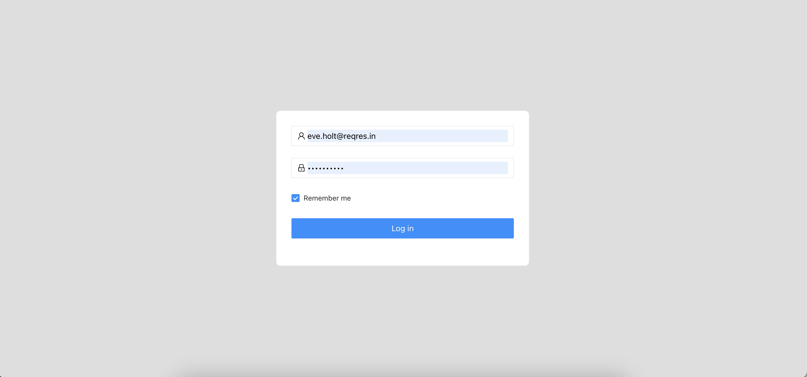

# React Developer Recruitment Task

## The task
Your job is to code an app with user list managment. Application must be SPA and use multiple routes (listed below). 

## Tech stack:
* API: [API DOCS](https://reqres.in/)
* Starter: [Create react app starter](https://github.com/facebook/create-react-app)
* State Managment: [Redux](https://github.com/reduxjs/react-redux)
* Middleware: [redux-thunk] or [redux-saga] (choose as per your knowledge)

## Screens:
Certainly! Here is a more detailed version of the text:

* `Login` 

    
    * Create a login page according to the provided design specifications.
    * Implement the login API integration and ensure that the token is saved securely.
    * Upon successful login, the user should be redirected to the `user list` page.
    * Use the following default credentials for testing purposes:
        ```json
        {
            "email": "eve.holt@reqres.in",
            "password": "cityslicka"
        }
        ```


* `Users List`
    
    * Display a list of users as per the design.
    * For each user in the list, display detailed information including their name, email, and other relevant details.
    * Ensure the list is styled and formatted according to the design guidelines.

      

* `Users CRUD`

    
    
    * Design and implement a modal for creating and editing users, following the provided design and API specifications.
    * Ensure that users can be created and edited through the modal interface.
    * Implement functionality to delete users, with confirmation prompts to prevent accidental deletions.
    * Make sure all CRUD operations (Create, Read, Update, Delete) are fully functional and tested.


* `Users Search and Pagination`
    
    * Implement client-side search functionality, allowing users to search by first name or last name.
    * Ensure the search results are updated in real-time as the user types.
    * Implement client-side pagination to divide the user list into pages as per the design specifications.


* `Card and List View`
    
    * Design a card view for displaying users, following the provided design specifications.
    * Implement functionality to switch between `List` and `Card` views, allowing users to choose their preferred display mode.
    * Ensure both views are fully functional, responsive, and consistent with the design guidelines.
      

## Must-have:
1. React &amp; Redux
2. Connection with API
3. Usage of react-router for multiple pages
4. Loaders when you wait for the data
5. Validation on forms
6. Usage of modern js functionality (ES6+)

## Good to have:
1. Typescript
2. Clean code (linters, prettier)
3. UI kit for styles (Ant Design or styled-components)
4. Tests

## What will we be paying attention to:
1. How you split code for components
2. How your store looks like and how you communicate with redux.
3. Reusability of the components.
4. Code repetitions and reusability.
5. How and where you put your business logic.
6. Code optimization and the solution&#39;s performance.
7. Working in accordance with good practices in general.
8. How you communicate with API.
9. Handling unexpected errors or potential exceptions.

## Upload your code to GitHub, or GitLab, or Bitbucket, and share the link with us. Additionally, host your application and provide the URL as well.
